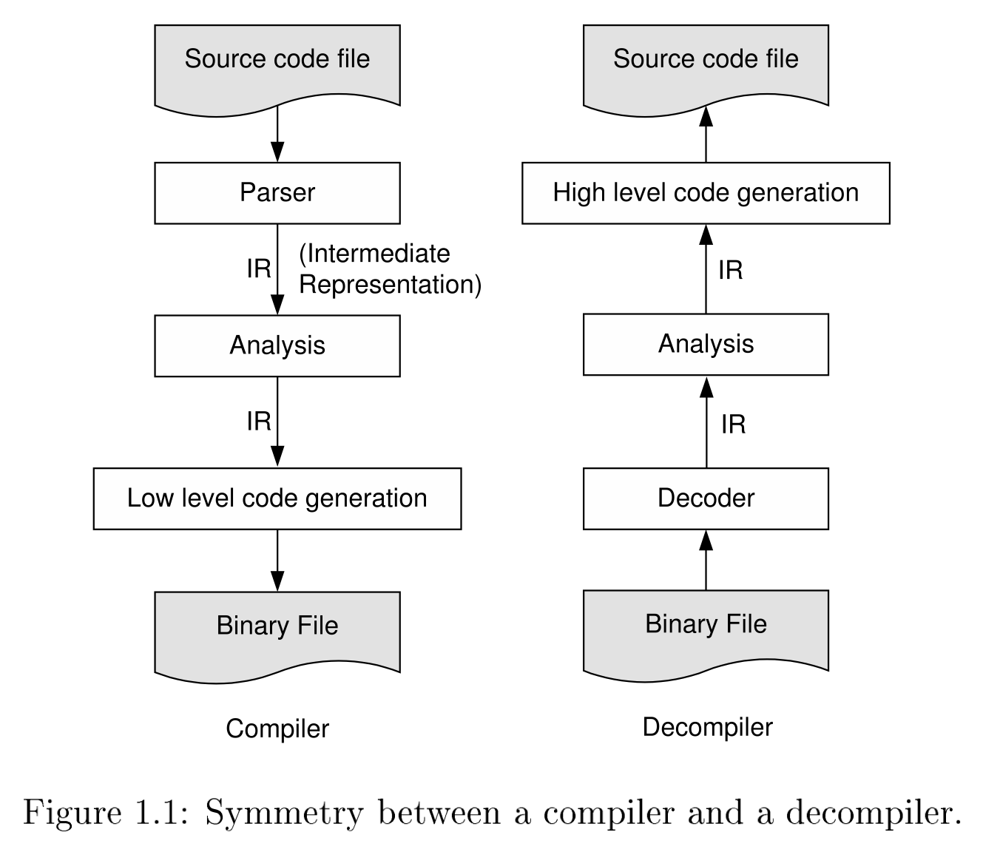

# SSA for Decompiler

## Introduction

### 当前反编译器的局限性：

1. Type recovery was poor to non existent.
2. There was poor translation of indirect jump instructions to switch/case statements.
3. There was even poorer handling of indirect call instructions, to e.g. indirect function calls in C, or virtual functions in C++.
4. The identification of parameters and returns made assumptions that were sometimes invalid.
5. Some decompilers had poor performance, or failed altogether, on programs more than a few tens of kilobytes in size.
6. Some decompilers produced output that resembled high level source code, but which would not compile without manual editing.
7. Some decompilers produced incorrect output, e.g. through incorrect assumptions about stack pointer preservations.

### 还未实现的功能：

1. 有意义的变量和函数名还没有生成
2. 枚举类型还没有生成

### 逆向工程工具的问题

1. 有一些信息在可执行文件的格式中是没有的，例如变量和过程名，注释，参数和返回值，类型等。
2. 一些信息被混合在了一起在某些类型的可执行文件中，难以很准确的分开。例如代码和数据的划分，立即数和指针的运算的划分，原始的指针（立即寻址的）和经过编译器预先计算好的偏移的指针的划分（这两种情况在底层都体现在都是一个立即数的地址，或者同一基址的地址。

### 编译过程中损失的信息

.png>)

### 理论上的局限性和近似方法

Compilers and decompilers face theoretical limits which can be avoided with conservative approximations, but while the result for a compiler is a correct but less optimised program, the result for a decompiler ranges from **a correct but less readable program to one that is incorrect**.

**根据Rice定理，计算机程序中所有non-trivial的属性都undecidable的，编译器和其他程序相关的工具都会存在理论上的局限性。**

这种情况下，编译器为了保证正确性会采取保守的行为。然而，在反编译器中， 也存在相似的限制，也可以为了保证正确的采取保守的行为。

### 反编译的目标

更好的识别参数和返回值，重构类型，正确地翻译间接跳转和调用

1. Correctly and not excessively propagating expressions from individual instruction semantics into appropriate complex expressions in the decompiled output.
2. Correctly identifying parameters and returns, without assuming compliance with the Application Binary Interface (ABI). This requires an analysis to determine whether a location is preserved or not by a procedure call, which can be problematic in the presence of recursion.
3. Inferring types for variables, parameters, and function returns. If possible, the more complex types such as arrays, structures, and unions should be correctly inferred.
4. Correctly analysing indirect jumps and calls, using the power of expression propagation and type analysis. If possible, calls to object oriented virtual functions should be recognised as such, and the output should make use of classes.

### 当前反编译器可能存在的问题，not handled well by current decompilers, to be handled correctly:

1. register and stack-based parameters that do not comply with the Application Binary Interface (ABI) standard,
2. parameters that are preserved,
3. parameters and returns should be recovered in the presence of recursion, without having to assume ABI compliance,
4. basic types should be recovered,
5. switch statements should be recognised despite code motion and other optimisa-tions, and
6. at least the simpler indirect call instructions should be converted to high level equivalents.

这些问题，本文的作者致力于解决。当前我们应该在这些方面达到更好的效果。

### 相关工作

1. 反汇编
2. Decompilation of DSP Assembly Language
3. Link-Time Optimisers
4. Synthesising to Hardware
5. Binary Translation
6. Instruction Set Simulation
7. Abstract Interpretation
8. Proof-Carrying Code
9. Safety Checking of Machine Code
10. Traditional Reverse Engineering
11. Compiler Infrastructures
12. Simplification of Mathematical Formulae
13. Obfuscation and Protection

## 数据流分析

.png>)

### 常用技术

1. **definitions and uses of locations**
2. **Expression Propagation:** Expression propagation is the most common transformation used by decompilers, and there are two simple rules, yet difficult to check, for when it can be applied.
3. **Limiting Propagation:** Although expression propagation is usually benecial in a decompiler, in some circumstances limiting propagation produces more readable output.
4. **Dead Code Elimination:** Dead code elimination is facilitated by storing all uses for each definition (definition-use information).
   1. **Condition Code Combining:** Expression propagation can be used to implement machine independent combining of condition code definitions and uses.
   2. **x86 Floating Point Compares:** Expression propagation can also be used to transform away machine details such as those revealed by older x86 floating point compare instruction sequences.
5. **Summarising Calls：**The effects of calls are best summarised by the locations modified by the callee, and the locations used before definition in the callee.
   1. **Call Related Terminology** The semantics of call statements and their side effects necessitates terminology that extends terms used by the compiler community.
   2. **Caller/Callee Context** Memory and register expressions are frequently communicated between callers and callee(s); the difference in context requires some substitutions to obtain expressions which are valid in the other context.
   3. **Globals, Parameters, and Returns** Three propositions determine how registers and global variables that are assigned to along only some paths should be treated.
      1. Locations assigned to on only some paths become parameters and returns.
      2. Global variables are never parameters or returns.
      3. Assignments to global variables should never be eliminated.
   4. **Call Summary Equations** The calculation of call-related data flow elements such as parameters, defines, and results can be concisely expressed in a series of data flow equations. (需要深入看看)
   5. **Stack Pointer as Parameter** The stack pointer, and occasionally other special pointers, can appear to be a parameter to every procedure, and is handled as a special case.
6. **Global Data Flow Analysis** Decompilers could treat the whole program as one large, global (whole-program) data flow problem, but the problems with such an approach may outweigh the benefits.
7. **Safe Approximation of Data Flow Information** Whether over- or under-estimation of data flow information is safe depends on the application; for decompilers, it is safe to overestimate both definitions and uses, with special considerations for calls. (page152)
8. **Overlapped Registers** Overlapped registers are diffcult to handle effectively in the intermediate representa-tion, but representing explicit side effects produces a correct program, and dead code elimination makes the result readable.

.png>)

.png>)

## SSA Form

The SSA form makes propagation very easy; initial parameters are readily identified, preservations are facilitated, and SSA's implicit use-definition information requires no maintenance.

The conversion from SSA form requires the insertion of copy statements; many factors affect how many copies are needed.

## Type Analysis for Decompilers

The SSA form enables a sparse data ow based type analysis system, which is well suited to decompilation.

The type analysis problem for decompilers is to associate each piece of data with a high-level type.

#### Domain of type variable is relatively small:

1. elementary types
2. pointer to a
3. an array of a
4. a structure or class
5. an enumerated type

.png>)

.png>)

.png>)

类型模式

.png>)

.png>)

## Indirect Jumps and Calls

While indirect jumps and calls have long been the most problematic of instructions for reverse engineering of executable files, their analysis, facilitated by SSA, yields high level constructs such as switch statements, function pointers, and class types.

### 间接跳转指令

1. switch statements
2. Assigned Goto Statements

### 间接调用

1. Virtual Function Calls

**Recovering the class hierarchy:** Value analysis on the VT pointer member, discussed in earlier sections, allows the comparison of VTs which may give clues about the original class hierarchy.

**Function Pointers:** Value analysis could be applied to function pointers, which should yield a subset of the set of possible targets, avoiding readability reductions that these pointers would otherwise cause.

**Splitting Functions:** A newly discovered indirect call, or occasionally a branch used as a call, could end up pointing to the middle of an existing function; this situation can be handled by splitting the function.

